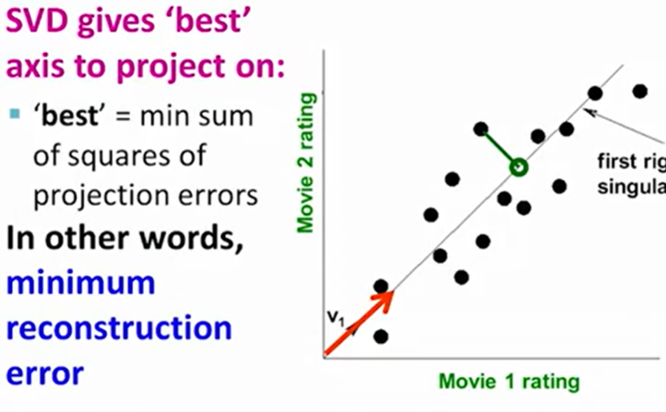
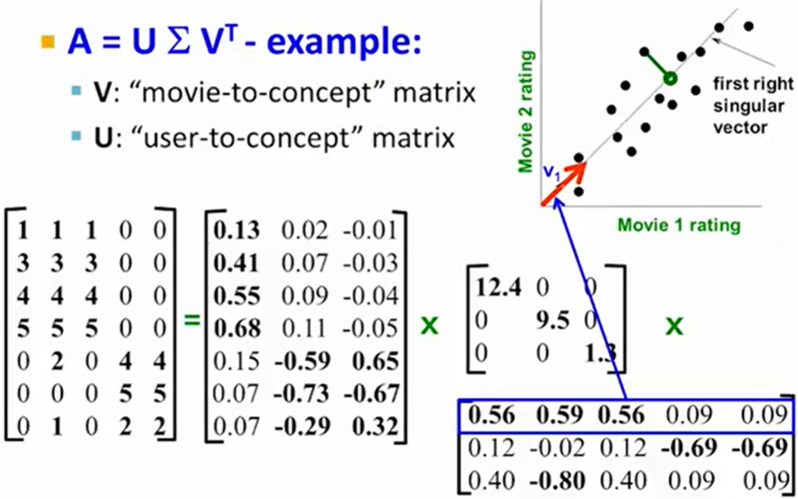
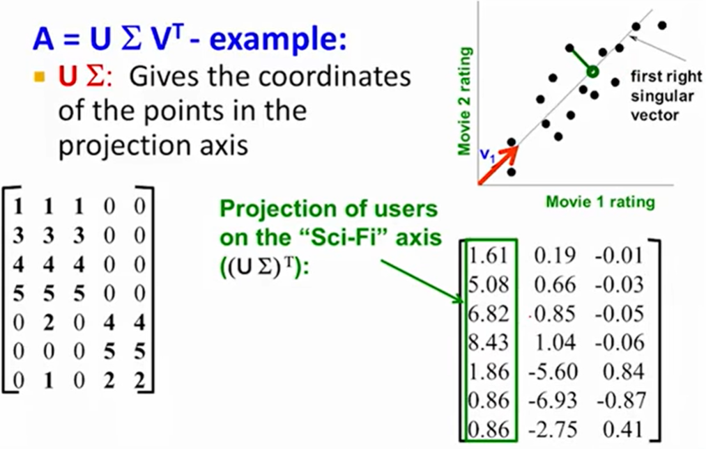
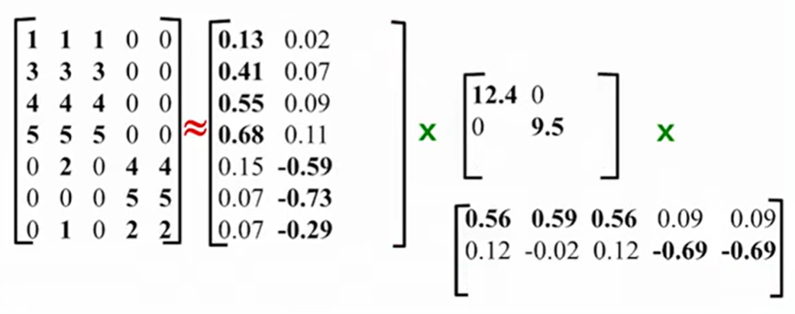
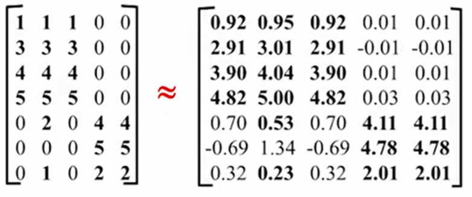

# Dimensionality Reduction: SVD

- Every data point you can represent as a single number, which is the projection of a given data point on the "best" axis

- Defines the Axis
- 'Sigma' gives the variance on the **v1** axis

- **NOTE**: Lots of variation along the 1st 2 axis

- **Dimensionality Reduction**: Set smallest singular values to zero
 + Discover hidden correlations/topics
 + Remove redundant & noisy features
 + Interpretation & Visualization
 + Easier storage & processing of data

---

# Principal Component Analysis
> Summarize the information contained in a continuous (i.e, quantitative) multivariate data by reducing the dimensionality of the data without loosing important information.

**GOAL**: identify directions _"principal components"_ along which the variation in the data is maximal
* **Eigenvalue**: the amount of variation retained in each principal component
* **Quality of Representation**:
  + A high cos2 indicates a good representation of the variable on the principal
component. In this case the variable is positioned close to the circumference
of the correlation circle.
  + A low cos2 indicates that the variable is not perfectly represented by the PCs. In this case the variable is close to the center of the circle.
  + For a given Variable, the sum of the cos2 on all PCs is equal to one.

# Correspondence Analysis
>  extension of the principal component analysis for analyzing a large contingency table formed by two qualitative
variables (or categorical data)

# Multiple Correspondence Analysis
> adaptation of CA to a data table containing more than two categorical variables.

# Factor Analysis of Mixed Data
> dedicated to analyze a data set containing both quantitative and qualitative variables.

# Multiple Factor Analysis
> dedicated to analyze data sets, in which variables are organized into groups (qualitative and/or quantitative variables)
