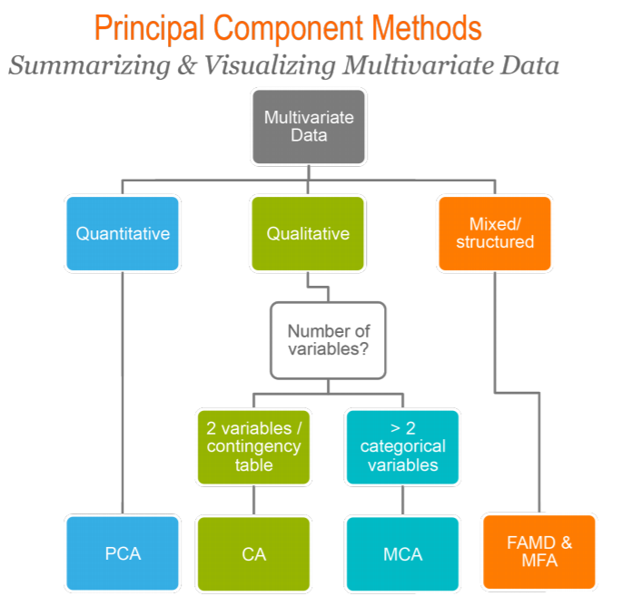
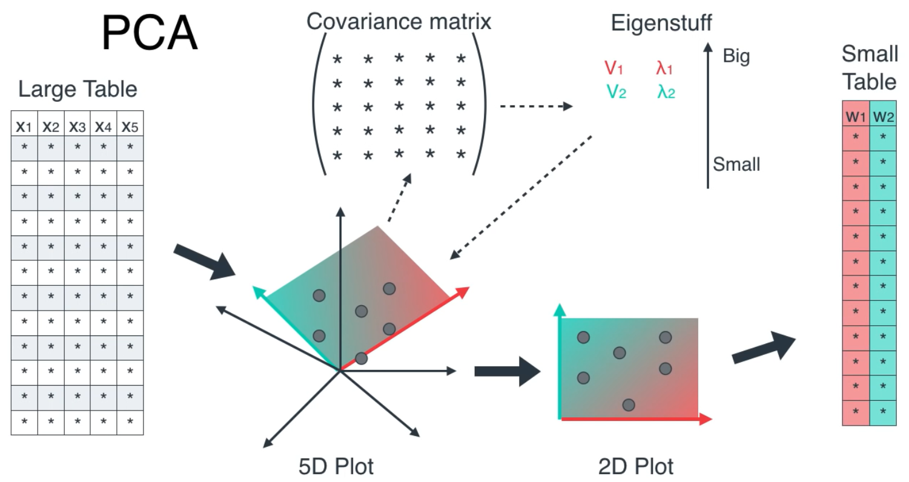

# Dimensionality Reduction
- Discover hidden correlations/topics
- Remove redundant & noisy features
- Interpretation & Visualization
- Easier storage & processing of data

# Principal Component Analysis

> Summarize the information contained in a continuous (i.e, quantitative) multivariate data by reducing the dimensionality of the data without loosing important information.
1. Maximies the projection of the variance onto a lower dimension (Figure out all the different eigenvalues of the covariance matrix, pick the biggest one, then figure out the eigenvector that matches the eigenvalue)

## Algorithm
1. s

# Correspondence Analysis
>  extension of the principal component analysis for analyzing a large contingency table formed by two qualitative
variables (or categorical data)

# Multiple Correspondence Analysis
> adaptation of CA to a data table containing more than two categorical variables.

# Factor Analysis of Mixed Data
> dedicated to analyze a data set containing both quantitative and qualitative variables.

# Multiple Factor Analysis
> dedicated to analyze data sets, in which variables are organized into groups (qualitative and/or quantitative variables)
